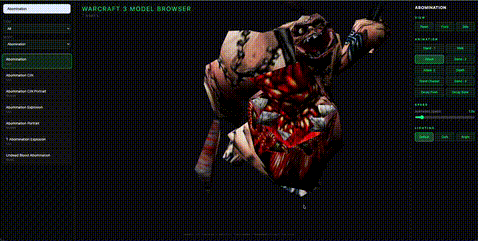

# Warcraft 3 Model Browser

A Three.js browser for viewing Warcraft 3 MDX models.

## Quick Start

```bash
cd dota-1-model && python -m http.server 8000
open http://localhost:8000
```

Review Models



## Project Structure

```
dota-1-model/
├── index.html              # Main viewer
├── css/styles.css          # Styling
├── js/viewer.js            # Three.js application
├── models/                 # Converted GLB files
├── docs/
│   └── ANIMATIONS.md       # How WC3 animations work and how to add them
├── scripts/
│   └── generate-model-manifest.mjs  # MDX to GLB converter
├── WarcraftModels/        # Source MDX files (3244 files)
│   └── manifest.json      # Model list with categories
└── README.md
```

## How It Works

1. **Source**: MDX files in `WarcraftModels/` (do not edit)
2. **Converted**: GLB files in `models/` (auto-generated)
3. **Manifest**: `WarcraftModels/manifest.json` lists all available models

## Features

- **3055 models** searchable by name
- **Type & model selects**: Filter by category, then pick a model (same as the list below)
- **Shareable URL**: `?category=unit` for type only; `?category=unit&model=Abomination` for a specific model (`category` is lowercase; `model` is the manifest id)
- **Search**: Filter by name across all models
- **3D viewer** with orbit controls (drag/zoom/pan)
- **Animation buttons**: Stand, Walk, Attack, Death, Spell (currently procedural; see [docs/ANIMATIONS.md](docs/ANIMATIONS.md) for real WC3 animation support)
- **Speed slider**: Adjust playback on top of a built-in **~25× WC3 baseline** (slider `1×` ≈ in-game speed; long clips like *Decay Flesh* may still need a higher slider value)
- **Lighting presets**: Default, Dark, Bright

## Converting New Models

When you add new MDX files to `WarcraftModels/`, run:

```bash
node scripts/generate-model-manifest.mjs
```

This will:

1. Scan for new MDX files
2. Convert them to GLB in `models/` (skips MDX when `models/<name>.glb` already exists — delete a GLB to force reconvert). **Reconvert** after pipeline fixes (e.g. animation timing): animations use clip-relative times so Walk / Stand play correctly in Three.js.
3. Update `manifest.json`

## Model Names

Names are formatted for readability:

- `AncestralGuardian` → "Ancestral Guardian"
- `HeroDreadLord` → "Hero Dread Lord"
- `V2` → " v2"

## Categories


| Category  | Description                   |
| --------- | ----------------------------- |
| Unit      | Base units, buildings, troops |
| Hero      | Hero models                   |
| Portrait  | UI portraits                  |
| Effect    | Spell effects, missiles       |
| Particle  | Fire, smoke, dust, fog        |
| Blood     | Blood splats and effects      |
| Spirit    | Ghosts and spirits            |
| Cinematic | Camera and cinematic models   |


